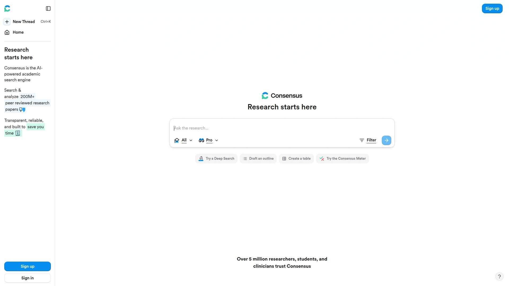
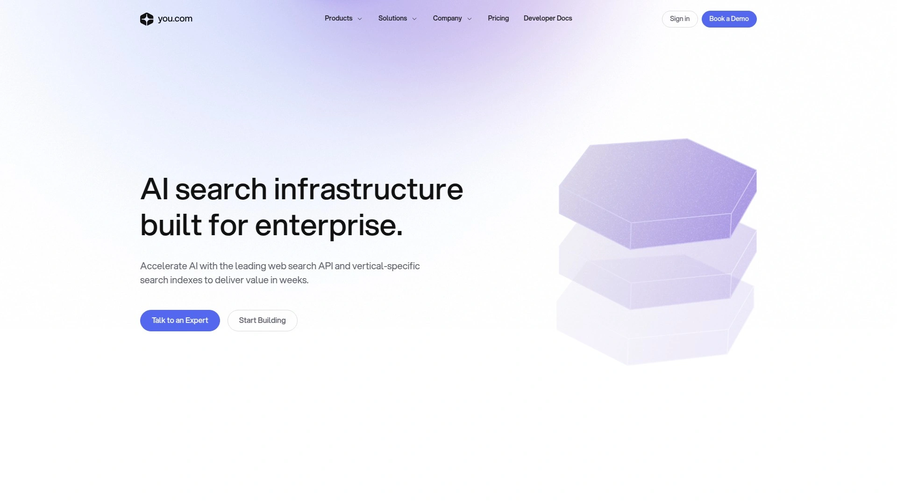
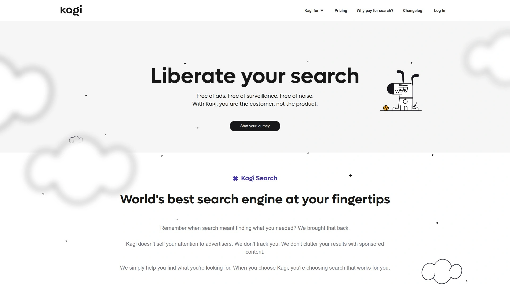
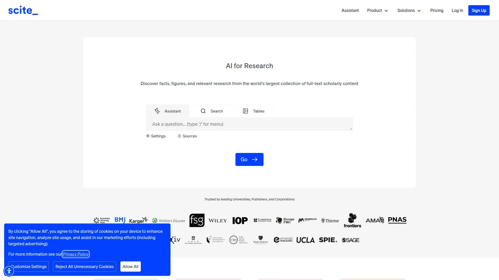
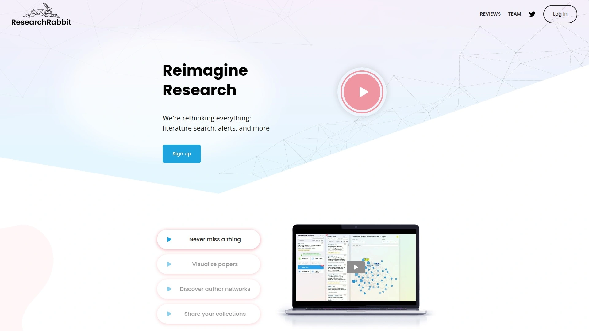
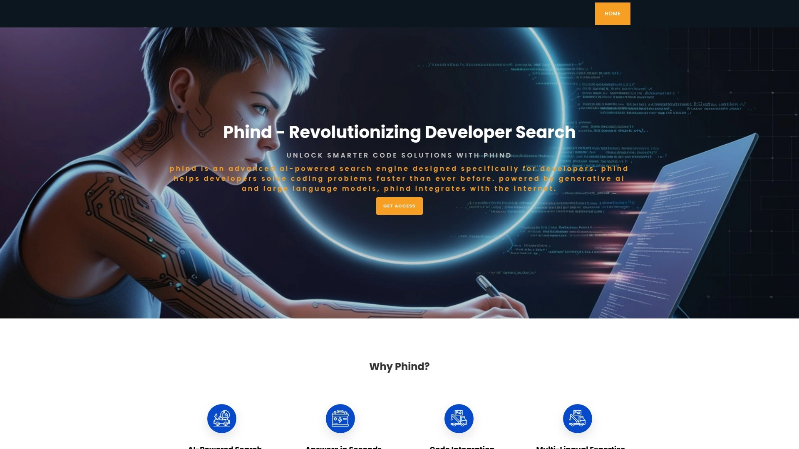

# 2025's Top 12 Best AI Research and Search Tools

Finding reliable information online shouldn't feel like searching for a needle in a haystack. Whether you're a student pulling together a literature review, a developer debugging code at 2 AM, or just someone who wants straight answers without clicking through ten blue links, the old way of searching doesn't cut it anymore. AI-powered research tools have changed the game by doing the heavy lifting for you—scanning sources, synthesizing information, and serving up answers you can actually use. These platforms combine intelligent search capabilities with research automation, helping you move from question to insight without the usual headache.

***

## **[Perplexity](https://pplx.ai/ixkwood69619635)**

Your conversational AI research companion that actually cites its sources.

Perplexity stands out because it treats search like a conversation with someone who's done their homework. You ask a question in plain language, and instead of getting a list of links, you get a well-researched answer with numbered citations pointing to the original sources. The platform uses advanced language models like GPT-4 and Claude to understand context and nuance, then searches the internet in real-time to gather information from authoritative sources.

**What makes it worth your time:** Pro Search lets you dive deep into topics with comprehensive, multi-source research that would normally take hours. The free tier gives you limited Pro searches daily, while Pro subscribers get unlimited access. Deep Research can automatically perform dozens of searches, read hundreds of sources, and deliver complete reports in just a few minutes. The interface remembers your conversation context, so you can ask follow-up questions without repeating yourself. Focus mode lets you narrow searches to specific domains like academic papers or Reddit discussions. For anyone who needs quick, reliable answers backed by verifiable sources, Perplexity hits that sweet spot between traditional search and AI chat.

***

## **[ChatGPT Search](https://openai.com/)**

OpenAI's conversational AI that now searches the web for current information.

ChatGPT Search blends natural language conversation with real-time web access. The platform automatically decides when to search the web based on your query, or you can manually trigger it by clicking the web search icon. It's available across web, desktop, and mobile apps, making it accessible wherever you work.

The search functionality pulls in up-to-date information including news, sports scores, stock quotes, and more—things ChatGPT couldn't access before. What's particularly useful is how it maintains conversational context across longer interactions, so you can drill down into topics without starting over. The system can run multiple searches automatically for complex questions and even search using uploaded images. The September 2025 update significantly improved accuracy and reliability, with better instruction following especially in extended conversations. While it can still make occasional mistakes that need fact-checking, the combination of ChatGPT's language understanding with web search creates a powerful research assistant that feels natural to use.

***

## **[Google Gemini](https://gemini.google.com/)**

Google's AI assistant with deep integration into search and productivity tools.

Gemini brings AI-powered research directly into Google's ecosystem. The platform uses a custom Gemini model specifically tuned for search, combining multi-step reasoning with Google's knowledge base and real-time web content. AI Overviews provide quick summaries of topics with links for deeper exploration, and the grounding feature connects to Google Search to reduce hallucinations and provide verifiable citations.

For researchers and students, Gemini Deep Research breaks down complex topics, explores the web systematically, and synthesizes findings into comprehensive reports. The free plan includes Deep Research capabilities, which is generous compared to competitors. The integration with Google Workspace means you can pull in Google Docs, Slides, and other files to inform your research. The platform handles multiple content types beyond text, including images and documents, making it versatile for different research scenarios. Since it's built on Google's infrastructure, it delivers near-instant results even for complex queries.

***

## **[Elicit](https://elicit.com/)**

Academic research assistant that automates literature reviews and extracts data from papers.

If you're buried in academic papers, Elicit becomes your research lab assistant. The tool specializes in helping researchers search, summarize, and understand scientific literature. It uses language models to perform semantic search across scholarly databases like Semantic Scholar, finding relevant papers even when they don't use your exact keywords.

Here's what it actually does: Start with a research question, and Elicit scans abstracts to provide one-sentence summaries answering your question. It automatically extracts key information like sample populations, study locations, interventions tested, and outcomes measured. The platform identifies whether papers support or contradict your hypothesis and flags randomized controlled trials. Elicit can follow citation trails both forward and backward, showing you what a paper references and who's cited it since publication. This replicates the manual process researchers already do but runs it faster and more systematically. The platform works best for empirical research questions in biomedicine, social science, and economics. Researchers report saving up to 80% of time on literature screening and data extraction for systematic reviews.

***

## **[Consensus](https://consensus.app/)**

Evidence-based search engine that extracts insights from 200 million peer-reviewed papers.

Consensus takes a different approach by focusing exclusively on scientific research. The platform uses AI and large language models to aggregate and distill insights from over 200 million peer-reviewed papers across all scientific domains. When you search, it doesn't just return papers—it extracts question-relevant information and generates AI summaries of top results.

The search engine uses ELSER semantic search technology from Elastic, which increased search accuracy by 30% and cut latency from four seconds to under one second. You can use flexible queries with synonyms and colloquial terms, not just exact academic jargon. Consensus pulls from the Semantic Scholar database, covering medicine, psychology, anthropology, climate science, and more. The platform is free to use and serves over 5 million researchers, doctors, and students worldwide. What sets it apart is the focus on evidence-backed answers—every response points directly to peer-reviewed sources, making it particularly valuable for academic writing, grant proposals, and fact-checking claims against scientific literature.

***

## **[You.com](https://you.com/)**

Enterprise-grade AI productivity engine designed for complex work queries.

You.com started as a search engine but evolved into what they call a productivity engine for knowledge workers. The platform combines web research with AI models from OpenAI, Anthropic, Google, and DeepSeek, automatically selecting the best model for your task in "Auto Mode."

ARI (Advanced Research & Insights) is their flagship feature—a deep research agent that processes 500+ sources and delivers professional-grade reports in minutes with rich visuals and citations. In head-to-head tests, ARI outperforms competing deep research tools 76% of the time. You can upload documents to benchmark against public knowledge or analyze proprietary information, making it valuable for consulting firms and professionals handling complex documents. The free tier includes AI search with citations, while paid plans unlock advanced research features and model selection. The platform's strength is handling multi-step problem solving that requires synthesizing information from multiple sources, not just simple factual queries.

***

## **[Brave Search](https://search.brave.com/)**

Privacy-first search engine with independent index and AI-powered answers.

Brave Search built its own search index from scratch instead of relying on Google or Bing, which means you get unfiltered results without big tech's algorithmic bias. The platform doesn't collect IP addresses, track users, or build profiles, making searches completely anonymous.

Answer with AI provides comprehensive summaries with supporting content, while Discussions surfaces conversations from Reddit and other forums directly in results. Goggles let you create custom filters and ranking rules to personalize results. The search interface is familiar—Google-style results with rich content previews, image strips, and video thumbnails. Brave's transparency features show you what percentage of results come from their own index versus third-party sources. The ad-free option costs $3/month, though the default free experience includes privacy-respecting ads. The independent index combined with strong privacy protections makes Brave appealing for anyone tired of personalized bubbles and data collection.

***

## **[Kagi](https://kagi.com/)**

Premium ad-free search engine with customizable results and AI features.

Kagi takes a different business model approach—you pay a subscription ($10/month) and get high-quality search without ads or tracking. The platform runs its own crawler (Teclis) for small-web searches and aggregates results from established engines with its own indexes.

The customization options are where Kagi shines. You can upvote, downvote, or completely block websites from your personal results. Lenses filter searches by category—find discussions, podcasts, PDFs, or focus on small blogs and forums. You can create custom lenses and bangs (shortcuts that redirect searches to specific sites). The AI quick response feature summarizes queries with sources, and a custom CSS editor lets you modify the interface. Kagi also offers Kagi Translate, which aims to beat Google Translate and DeepL at translation quality. The focus is on the search experience itself without trying to keep you on their platform or harvest your data for advertising.

***

## **[Scite](https://scite.ai/)**

Smart citation analysis tool that shows how research papers are being cited.

Scite analyzes over 1.2 billion citations from 185 million full-text articles to provide context around how papers are actually being used. The platform's Smart Citations feature distinguishes whether a citation provides supporting evidence, contrasting evidence, or simply mentions another work. This helps you evaluate paper credibility and understand real-world impact.

Beyond citation analysis, Scite offers an AI assistant that works like ChatGPT but grounds every response in citation statements from full-text articles. You can ask research questions in plain language and get answers backed by their database of verified citations. The platform provides visualizations and reports showing citation patterns, plus alerts to monitor your work's influence. A browser extension displays Smart Citations while you read articles online. Researchers use Scite to make informed decisions about which papers to read, cite, or trust. The focus on citation context rather than just citation counts gives you deeper insight into how research is actually being interpreted and applied in the field.

***

## **[ResearchRabbit](https://www.researchrabbit.ai/)**

Visual literature discovery tool that maps research connections.

ResearchRabbit helps you discover research through citation networks and visual mapping. Start by adding a few seed papers you already know, and the tool uncovers related studies using citation trails, co-citation networks, and topic similarity. For any paper, you can explore similar work, all references (backward citations), and all citations (forward citations).

The visualization feature creates interactive maps showing how papers connect through citations. Each paper appears as a node, with lines representing citation relationships. You can drag papers around, zoom into clusters, and trace paths between studies. This visual perspective helps identify influential papers, spot research gaps, and understand topic evolution over time. Author network visualizations show connections between researchers, helping you find big names and collaborators in your field. As you add papers, ResearchRabbit refines its recommendations to match your interests. The interface uses columns to show different views, making it easy to jump between papers without losing your place. It's completely free and saves significant time compared to manually following citation trails.

***

## **[NotebookLM](https://notebooklm.google.com/)**

Google's AI research notebook that turns your documents into interactive conversations.

NotebookLM reimagines note-taking by grounding AI in your specific sources rather than general knowledge. You upload Google Docs, PDFs, websites, slides, or other documents, and the tool creates a personalized AI versed in that material. It automatically generates document guides with summaries, key topics, and suggested questions.

The standout feature is Audio Overviews—NotebookLM converts documents into podcast-style conversations between two AI hosts, making complex material more digestible. You can ask questions about uploaded documents and get answers cited directly from your sources, making fact-checking easy. The tool helps with literature reviews, glossary creation, script generation, and brainstorming investor questions. NotebookLM Plus, available through Google One AI Premium and Workspace plans, provides enhanced features for research and organization. Since it's grounded in your sources rather than general internet data, it reduces hallucinations and keeps responses relevant to your actual materials. The interface is clean and uncluttered, focused on helping you synthesize facts and ideas from multiple sources without drowning in information overload.

***

## **[Phind](https://www.phindai.com/)**

Developer-focused AI search engine optimized for technical queries and coding.

Phind specializes in answering programming questions with code snippets and technical explanations. The platform understands developer jargon and context, searching official documentation, Stack Overflow, GitHub discussions, and technical blogs to provide accurate, up-to-date responses. Unlike generic AI chatbots, Phind delivers precise, code-focused answers rather than generic explanations.

The VS Code extension lets you highlight code and instantly get explanations, bug fixes, and refactoring suggestions without leaving your editor. Unlike GitHub Copilot which focuses on autocomplete, Phind explains existing code, troubleshoots errors, and provides insights into concepts. The platform supports multiple languages (Python, JavaScript, Rust, C++, SQL, Terraform) and frameworks (React, Django, AWS, Kubernetes). Every answer includes citations to source documentation, making responses more reliable than tools that hallucinate facts. The interface includes interactive graphics showing the research process, and responses arrive in seconds. For developers dealing with unfamiliar APIs, debugging issues, or learning new technologies, Phind cuts through generic AI responses to deliver solutions that actually work.

***

## **FAQ**

**How do AI research tools differ from regular search engines?**

Traditional search engines give you links to wade through, while AI research tools synthesize information from multiple sources and present direct answers with citations. They understand context, can follow up on previous questions, and often perform multiple searches automatically to compile comprehensive responses. Think of them as research assistants that read sources for you rather than librarians who point you to shelves.

**Are these tools suitable for academic research and citations?**

Tools like Elicit, Consensus, Scite, and ResearchRabbit are specifically designed for academic work with features like citation analysis, paper discovery, and systematic review automation. They pull from peer-reviewed sources and provide proper citations. However, always fact-check AI-generated content against original sources before citing in formal academic work, as these tools can occasionally misinterpret nuance or context.

**Do I need paid subscriptions or are free tiers sufficient?**

Most platforms offer generous free tiers that work well for casual research. [Perplexity](https://www.perplexity.ai/) gives limited Pro searches daily on the free plan, Consensus and ResearchRabbit are completely free, and Google Gemini includes Deep Research at no cost. Paid plans typically add unlimited searches, advanced models, faster processing, or premium features. Start with free versions to find what fits your workflow, then upgrade if you hit limitations.

***

## **Conclusion**

The research landscape has shifted from manual hunting to AI-assisted discovery. Whether you need quick factual answers, deep academic literature reviews, or developer-specific technical solutions, there's a tool designed for your specific workflow. [Perplexity](https://pplx.ai/ixkwood69619635) remains the top choice for general research needs because it nails the balance between conversational ease and source credibility—you get comprehensive answers that feel like talking to an expert while maintaining full transparency about where information comes from. For students, researchers, developers, and knowledge workers, these tools don't just save time—they fundamentally improve how thoroughly you can explore topics and how quickly you can move from curiosity to insight.
